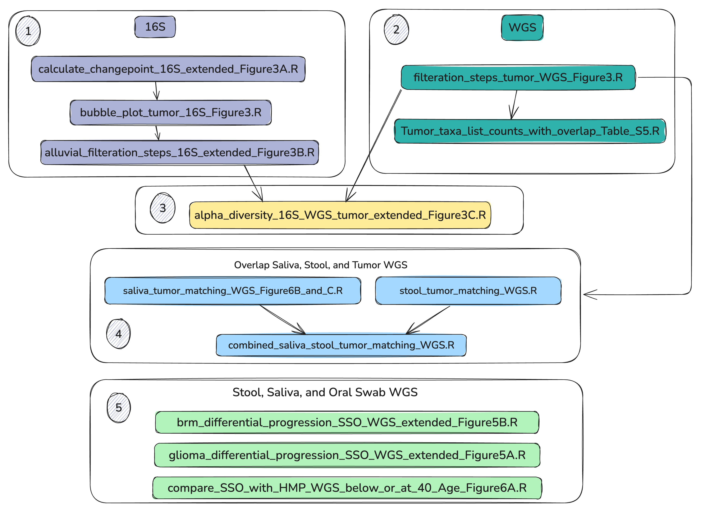

# Code for Microbiome analysis 


## R packages:
Please install these packages

| Package Name | Version | Purpose  | Repository
|:--|:--|:--|:--|
| ANCOMBC | ==2.6.0|Differential analysis|https://bioconductor.org/packages/3.19/bioc/html/ANCOMBC.html
| cardx | =0.5.1 | For data summary table | CRAN (R 4.4.1)
| ggalluvial | =0.12.5 | Alluvial plots | CRAN (R 4.4.0)
| ggchangepoint | =0.1.0 | Detect and plot change points | CRAN (R 4.4.0)
| ggh4x | =0.3.0 | Adjust faceted plot sizing | CRAN (R 4.4.1)
| ggrepel |= 0.9.6| Label plots | CRAN (R 4.4.1)
| gtsummary |  =2.1.0| Summary tables stats | CRAN (R 4.4.1)
| janitor | =2.2.1 | sanitize column headers | CRAN (R 4.4.1)
| Maaslin2 | =1.20.0 | Differential analysis | Bioconductor 3.20 (R 4.4.1)
| microViz | =0.12.6 | Visualize taxonomy | https://github.com/david-barnett/microViz/
| patchwork | =1.3.0 | Combine ggplot2 plots | CRAN (R 4.4.1)
|phyloseq  | =1.50.0 | Transform and pack microbiome data | Bioconductor 3.20 (R 4.4.3)
|speedyseq | =0.5.3.9021| Transform and filter microbiome data | https://github.com/mikemc/speedyseq
|tidytext | =0.4.2| rearrange taxa within ggplot2 facets | CRAN (R 4.4.0)
|tidyverse  | =2.0.0 | Transform tabular data | CRAN (R 4.4.0)
|vegan | =2.6-8 | Alpha diversity indices | CRAN (R 4.4.1)

## Script structure

Go to the microbiome folder

```
cd Microbiome_Brain_Tumors
```

Run R scripts in order using this one liner. 

```
for dir in $(ls -d ./scripts/[0-9]*_* | sort -n); do echo "Directory: $dir"; find "$dir" -name "*.R" | sort | xargs -I{} sh -c 'echo "Running: {}"; Rscript "{}"'; done
```


The `src folder` contains all the scripts for common function and loading libraries

The `script folder` contains all the scripts under numbered folder to guide the users for order or executing scripts

`data`  folder contains

 * `raw_data` :  raw data files which are used to generate figures and files in `processed_data` folder. 
 * `metadata` : metadata related to the sequencing information.
 * `processed_data` : Data files generated while running this analysis script.

`output` folder contains

* `figures` : figures generated during the analysis
* `tables` : Summary and stats table generated during the analysis

``session_info.txt`` : This file contains all the packages that are loaded in the R environment during the analysis. 

`WGS` and `16S` folders are created where necessary to indicate which sequencing data used to generate the output. 


## Script workflow 


